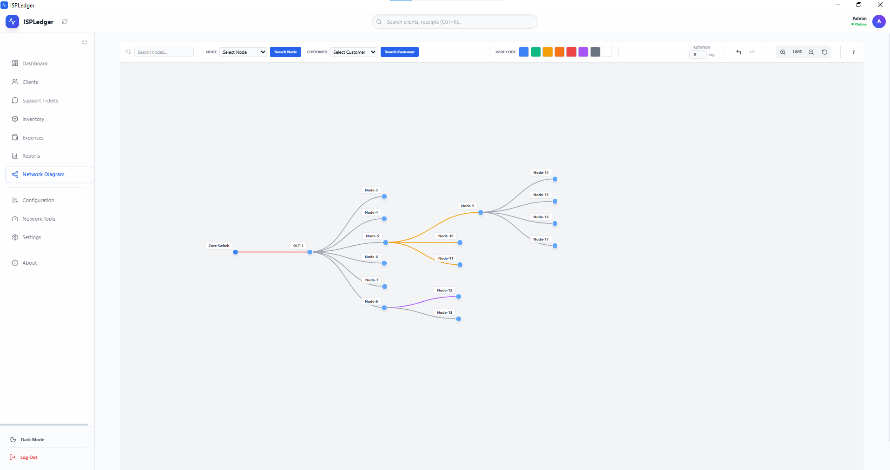
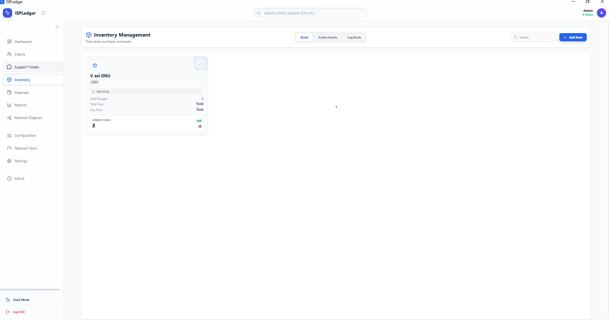
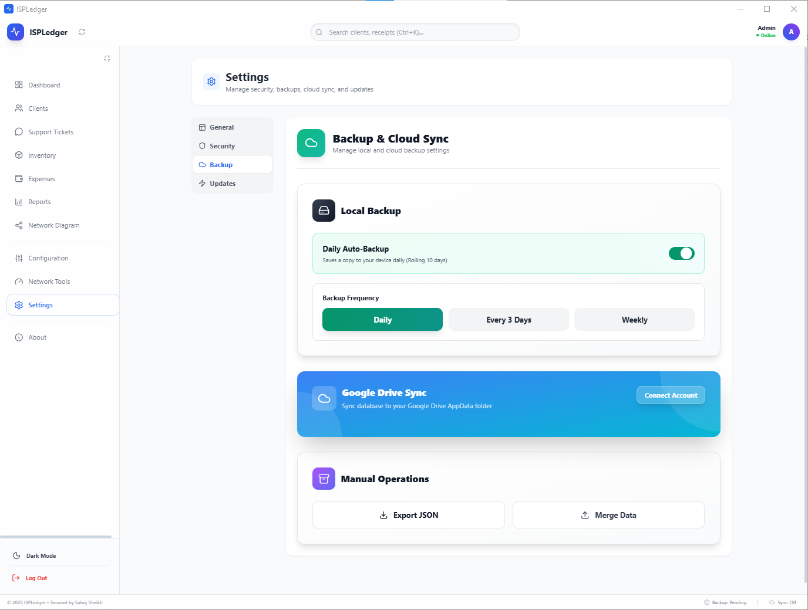

# ISPLedger – Free Offline-First ISP & Billing Management Software

**ISPLedger** is a completely free, Windows desktop application designed to help Internet Service Providers (ISPs), small businesses, and local operators manage clients, billing, and finances with ease. Your data stays 100% on your computer, works offline-first, and never requires a subscription or license key.

---

## 🎯 What Problem Does ISPLedger Solve?

Running a small ISP or local internet business comes with its own challenges:
- Keeping track of hundreds of clients manually
- Managing monthly bills, payments, and overdue accounts
- Storing data safely without relying on expensive cloud services
- Finding affordable (or free) billing software that actually works offline

**ISPLedger solves all of this.** It's a desktop tool built specifically for people who need reliable client and billing management without the complexity, cost, or dependency on internet connectivity.

---

## ✨ Key Features

- **100% Free** – No hidden costs, no subscriptions, no license keys, ever.
- **Offline-First** – Works completely without an internet connection. Your business never stops.
- **Windows Desktop Application** – Built with .NET (WPF) and WebView2 for a modern, responsive experience.
- **Client Management** – Organize and manage all your clients in one place.
- **Billing & Invoicing** – Track monthly bills, payments, overdue amounts, and collections effortlessly.
- **Expense Tracking** – Monitor daily collections and business expenses to keep finances transparent.
- **Network Diagram Tool** – Visualize your ISP network topology with an intuitive drag-and-drop interface.
- **Support Ticket System** – Manage client issues and service requests efficiently.
- **Local Data Storage** – All your data is stored securely on your own computer.
- **Optional Google Drive Backup** – Backup your data to Google Drive whenever you want (completely optional).
- **Auto-Update System** – Get the latest features and improvements automatically.
- **Dark Mode Support** – Easy on the eyes during late-night work sessions.

---

## 🌐 Offline-First Philosophy

ISPLedger is designed with **offline-first** as a core principle. Many ISP operators work in areas with unreliable internet, or simply prefer to keep their business data local and private.

With ISPLedger:
- You don't need an internet connection to access your clients or billing records
- No data is sent to external servers unless you explicitly choose to back up to Google Drive
- You're in full control of your information at all times

If the internet goes down, **your business operations don't**. That's the ISPLedger promise.

---

## 💾 Data Storage & Backup System

### Local Storage
All your client data, billing records, expenses, and settings are stored **locally on your computer** in a secure, structured format. No third-party servers involved.

### Optional Google Drive Backup
ISPLedger offers an **optional** Google Drive integration:
- You can back up your entire database to your personal Google Drive
- Restore your data from Google Drive anytime
- Backups are encrypted and only accessible by you
- **This is completely optional** – you can use ISPLedger without ever connecting to Google Drive

---

## 📸 Screenshots

*Manage all your clients, billing, and daily collections at a glance*

*Monthly client billing sheet with payment tracking*

*Visualize and manage your ISP network topology*

*Track daily collections and business expenses*

*Track monthly reports*

*Track Clients complaints with support tickets*

*Track Every inventory, buy, sold, stock, lent*

*Backup your data with google drive and local for no data loss*

*(the software is fully functional and ready to use)*

---

## � Installation Guide

### System Requirements
- **Operating System:** Windows 10 or later (64-bit)
- **Framework:** .NET Framework (automatically installed if not present)
- **WebView2 Runtime:** Automatically installed during setup if needed

### Step-by-Step Installation

1. **Download the Installer**
   - Visit the [Releases](https://github.com/Sabujsheiikh/isp-ledger-desktop/releases/download/V2.1.2) page
   - Download the latest `ISPLedger-Setup-x.x.x.exe` file

2. **Run the Installer**
   - Double-click the downloaded `.exe` file
   - Windows may show a security warning – click "More Info" then "Run Anyway" (this is normal for new software)

3. **Follow the Setup Wizard**
   - Click "Next" to proceed through the installation steps
   - Choose your installation folder (default is recommended)
   - Click "Install" to begin installation

4. **Launch ISPLedger**
   - After installation, ISPLedger will launch automatically
   - You can also find it in your Start Menu under "ISPLedger"
   - A desktop shortcut is created for easy access

5. **First-Time Setup**
   - Create your account (all data stays local)
   - Start adding clients and managing your business

**That's it!** You're ready to use ISPLedger.

---

## � How to Update the Software

ISPLedger includes an **automatic update checker**:
- When a new version is available, you'll see a notification in the app
- Click "Update Now" to download and install the latest version
- Your data is preserved during updates

You can also manually check for updates from the app's settings menu.

---

## 👥 Who Should Use ISPLedger?

ISPLedger is perfect for:

- **Internet Service Providers (ISPs)** – Small to medium-sized ISPs managing local clients
- **Wireless Internet Operators** – WISPs and local wireless providers
- **Cable Internet Providers** – Local cable operators serving communities
- **Small Business Owners** – Anyone who needs client and billing management
- **Freelancers & Consultants** – Track clients, invoices, and payments
- **Local Network Operators** – Manage clients and billing for any network service

If you provide internet or any subscription-based service to clients and need a simple, reliable, offline tool to manage everything, **ISPLedger is for you**.

---

## 💰 Is It Really Free?

**Yes. Absolutely. 100% free.**

- No trial period
- No premium version
- No hidden features behind a paywall
- No subscription fees
- No license keys to purchase
- No "freemium" tricks

ISPLedger is built to help people, not to make money. It's a passion project created by someone who understands the struggles of running a small ISP or local business.

You can use ISPLedger for your personal use, your business, or even recommend it to others – completely free, forever.

---

## 🔒 Privacy & Data Safety

Your data privacy is a top priority:

- **No Data Collection** – ISPLedger does not collect, track, or send your data anywhere
- **Local Storage Only** – All data is stored on your computer, not on external servers
- **No Analytics** – We don't track how you use the software
- **No Telemetry** – Your usage patterns and data remain private
- **Optional Cloud Backup** – Google Drive backup is opt-in only; nothing is uploaded without your explicit permission

Your client data, billing records, and business information belong to **you and only you**.

---

## 🤝 Contributing

While ISPLedger is currently maintained as a solo project, feedback and suggestions are always welcome!

If you encounter bugs, have feature requests, or want to suggest improvements:
- Open an issue on the [GitHub Issues](https://github.com/yourusername/ISPLedger/issues) page
- Describe your issue or idea clearly
- I'll do my best to respond and improve the software

---

## � License

ISPLedger is **free to use** with no restrictions for personal or commercial purposes. 

The software is provided "as-is" without warranty of any kind. Use it freely, share it with others, and enjoy managing your business without worrying about software costs.

---

## 🌟 Support the Project

If ISPLedger helps your business, consider:
- ⭐ **Starring this repository** on GitHub to help others discover it
- 📢 **Sharing it** with other ISP operators or small business owners
- 💬 **Leaving feedback** to help improve future versions

Your support helps ISPLedger reach more people who need it!

---

## � Contact & Support

- **GitHub Issues:** [Report bugs or request features](https://github.com/Sabujsheiikh/isp-ledger-desktop/issues)
- **Email:** sabujsheiikh@gmail.com *(replace with actual contact)*
- **Documentation:** [User Guide & Tutorials](https://github.com/Sabujsheiikh/isp-ledger-desktop/wiki) *(coming soon)*

---

## 🚀 Download Now

Ready to simplify your ISP or business management?

**[Download ISPLedger](https://github.com/Sabujsheiikh/isp-ledger-desktop/releases/latest)**

Experience the freedom of offline-first, free, and powerful billing and client management software.

---

*Built with ❤️ for ISP operators and small business owners everywhere.*
